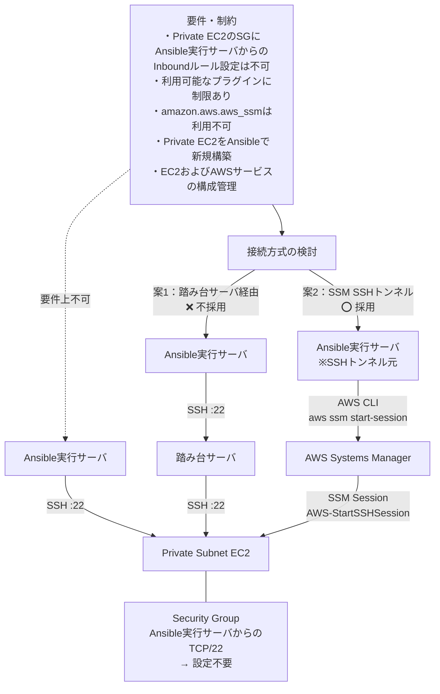

# AnsibleによるPrivate EC2の構成管理

Ansibleを利用して、AWS上のPrivate Subnetに配置されたEC2の構築・構成管理を行うためのPlaybookです。

Private EC2に対してAnsibleから直接SSH接続するのではなく、**AWS Systems Manager（SSM）を利用したSSHトンネル方式**を採用しています。

## Architecture



## 背景・要件

本構成では、以下の要件・制約があります。

- Private EC2のSecurity Groupに、Ansible実行サーバからのTCP/22 Inboundルールを追加することは要件上不可
- 利用可能なAnsibleプラグインに制限があり、`amazon.aws.aws_ssm` は利用不可
- Private EC2はAnsibleから新規構築する
- 構築後のEC2に対して、Ansibleによる構成管理を行う
- EC2だけでなく、その他のAWSサービスについても構成管理を行う

これらの制約から、Private EC2に対してAnsible実行サーバから直接SSH接続する方式は採用できません。

## 接続方式の検討

Private EC2への接続方式として、以下の2案を検討しました。

### 案1：踏み台サーバ経由によるSSH接続

```text
Ansible実行サーバ
        │
        │ SSH :22
        ▼
    踏み台サーバ
        │
        │ SSH :22
        ▼
  Private EC2
```

この方式では、Ansible実行サーバから踏み台サーバへSSH接続し、踏み台サーバからPrivate EC2へSSH接続します。

この方式であればPrivate EC2へのSSH接続は可能ですが、Private EC2へのSSH接続を実現するためだけに踏み台サーバを新たに設置・運用することは、サーバ自体の構築・OS管理・監視などの運用コストや管理対象の増加につながります。

### 案2：AWS Systems Managerを利用したSSHトンネル

採用した方式では、AWS Systems ManagerのSession Managerを利用してPrivate EC2へのSSH通信経路を確立します。

```text
Ansible実行サーバ
        │
        │ AWS CLI
        │ aws ssm start-session
        ▼
AWS Systems Manager
        │
        │ AWS-StartSSHSession
        ▼
  Private EC2
```

この方式では、Ansible実行サーバからPrivate EC2へのTCP/22 Inbound通信をSecurity Groupに許可する必要がありません。

また、踏み台サーバの追加構築も不要のため、案1で課題となっていた運用コストや管理対象の増加を抑えつつ、既存のAWS Systems Managerを活用してPrivate EC2への接続を実現できます。

そのため、今回の要件・制約を満たすことができる本方式を採用しました。

## 採用方式

最終的に、以下の構成を採用しました。

```text
┌──────────────────────┐
│ Ansible実行サーバ     │
│                      │
│ Ansible              │
│ AWS CLI              │
└──────────┬───────────┘
           │
           │ SSH / ProxyCommand
           │ aws ssm start-session
           ▼
┌──────────────────────┐
│ AWS Systems Manager  │
│                      │
│ Session Manager      │
└──────────┬───────────┘
           │
           │ SSM Session
           │ AWS-StartSSHSession
           ▼
┌──────────────────────┐
│ Private Subnet EC2   │
│                      │
│ SSH :22              │
└──────────────────────┘
```

## `amazon.aws.aws_ssm`を使用しない理由

AnsibleにはAWS Systems Managerを利用した接続方式がありますが、今回の要件・制約では利用可能なプラグインに制限があり、`amazon.aws.aws_ssm`を利用できません。

そのため、AWS CLIの

```bash
aws ssm start-session
```

とSSHの`ProxyCommand`を組み合わせることで、SSMを利用した接続経路を実現しています。

この方式により、特定のAnsible接続プラグインに依存せず、SSHベースのAnsible構成管理を行います。

## Security Group

Private EC2のSecurity Groupには、Ansible実行サーバからのTCP/22 Inboundルールを設定していません。

```text
Ansible実行サーバ
       │
       │ TCP/22 Inbound
       │
       X  ← 許可しない
       │
Private EC2
```

Private EC2への接続経路はAWS Systems Managerによって確立されます。

そのため、Private EC2をAnsible実行サーバから直接SSH接続可能にするためのInboundルールを追加する必要がありません。

## 実行方法

### 全環境

```bash
ansible-playbook -i inventory.ini site.yml
```

### UT環境

```bash
ansible-playbook -i inventory.ini site.yml --limit instance-ut
```

### 特定のEC2

```bash
ansible-playbook -i inventory.ini site.yml --limit test_sv_uta
```
